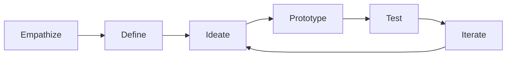

<div align="center">
  
  <h1>Design Thinking Lab</h1>
  <p>
    Interactive showcase of the <strong>5-stage Design Thinking framework</strong>,
    brought to life through a real product case study: a Time Management App.
  </p>
</div>

<p align="center">
  <a href="https://design-thinking-lab.vercel.app">
    
  </a>
  <a href="https://time-management-app-theta.vercel.app">
    
  </a>
  
  
  
</p>

## Why This Project

This repository documents a semester Design Thinking journey from research to prototyping and iteration.  
The core output is a polished website that communicates both the process and a practical solution for time-management challenges faced by students.

## Experience Links

| Experience | URL | Purpose |
| --- | --- | --- |
| Main Showcase | https://design-thinking-lab.vercel.app | Explore the complete design thinking narrative |
| Time Management App | https://time-management-app-theta.vercel.app | Interact with the case study prototype |

## Design Thinking Flow



## Product Highlights

| Area | What You See | Why It Matters |
| --- | --- | --- |
| Immersive UI | Three.js-powered space background and layered visual depth | Makes the learning experience memorable |
| Structured Storytelling | Dedicated sections for process, case study, insights, and reflection | Keeps the journey easy to follow |
| Motion Design | Scroll-triggered reveal behavior and smooth transitions | Improves clarity and perceived polish |
| Responsive Build | Mobile-first navigation and adaptable layout | Works cleanly across device sizes |
| Real Case Study | Time Management App with problem framing and solution strategy | Connects theory to practice |

## Tech Stack

| Layer | Tools |
| --- | --- |
| Frontend | React 19, React DOM |
| Build Tooling | Vite 6, ESLint 9 |
| Visuals and Motion | Three.js, GSAP, Intersection Observer |
| Deployment | Vercel |

## Quick Start

### Prerequisites

- Node.js 18+ (Node.js 20 LTS recommended)
- npm 9+

### Setup

```bash
git clone https://github.com/Anish-2005/Design-Thinking.git
cd Design-Thinking
npm install
npm run dev
```

Open `http://localhost:5173`.

### Scripts

```bash
npm run dev      # Start local dev server
npm run build    # Create production build
npm run preview  # Preview the production build
npm run lint     # Run lint checks
```

## Project Structure

```text
.
|-- public/
|   |-- dt-logo.svg
|   |-- dt.png
|   |-- robots.txt
|   `-- sitemap.xml
|-- src/
|   |-- components/
|   |-- data/
|   |-- hooks/
|   |-- App.jsx
|   |-- root.jsx
|   `-- main.jsx
|-- eslint.config.js
|-- vite.config.js
|-- vercel.json
`-- README.md
```

## Contributing

Contributions are welcome. Please read [CONTRIBUTING.md](./CONTRIBUTING.md) before opening a pull request.

## License

This project is licensed under the MIT License. See [LICENSE](./LICENSE).

## Contact

- LinkedIn: [Anish Seth](https://linkedin.com/in/anishseth)
- Email: anishseth0510@gmail.com
